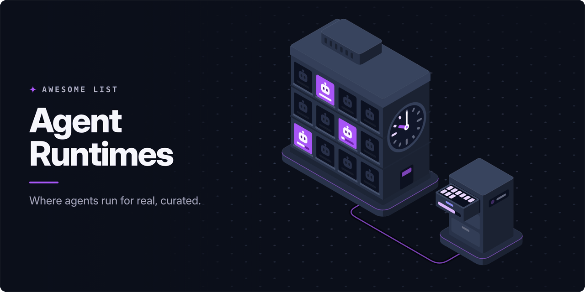

<!-- awesome:hero --><!-- /awesome:hero -->

<!-- awesome:title --><h1 align="center">Awesome Agent Runtimes</h1><!-- /awesome:title -->

<!-- awesome:tagline -->Managed platforms, durable execution engines and agent servers where AI agents live, keep state and run for long.<!-- /awesome:tagline -->

<!-- awesome:badges -->

  
  
  

<!-- /awesome:badges -->

An agent runtime is the place an AI agent lives after the demo: it keeps the agent's state, survives crashes and restarts, and lets a run pause for hours or days. This list covers managed agent platforms, durable execution engines, self-hosted agent servers and stateful runtimes; code sandboxes live on [Awesome Agent Sandboxes](https://github.com/ianwieds/awesome-agent-sandboxes).

## Contents

- [Managed cloud platforms](#managed-cloud-platforms)
- [Agent hosting services](#agent-hosting-services)
- [Self-hosted agent servers](#self-hosted-agent-servers)
- [Stateful runtimes and sessions](#stateful-runtimes-and-sessions)
- [Durable execution engines](#durable-execution-engines)
- [Kubernetes runtimes](#kubernetes-runtimes)
- [Deployment kits and examples](#deployment-kits-and-examples)
- [Guides and reading](#guides-and-reading)
- [Contributing](#contributing)

## Managed cloud platforms

- [Amazon Bedrock AgentCore Runtime](https://docs.aws.amazon.com/bedrock-agentcore/latest/devguide/agents-tools-runtime.html) - AWS serverless runtime that hosts agents from any framework in isolated, long-lived sessions.
- [Claude Managed Agents](https://platform.claude.com/docs/en/managed-agents/overview) - Anthropic's hosted agent harness that runs long, asynchronous tasks on managed infrastructure.
- [Databricks Agent Bricks](https://www.databricks.com/product/artificial-intelligence/agent-bricks) - Databricks service that builds, tunes and serves agents on company data.
- [Gemini Enterprise Agent Platform](https://docs.cloud.google.com/gemini-enterprise-agent-platform/scale) - Google Cloud's managed runtime, formerly Vertex AI Agent Engine, that deploys and scales agents.
- [Heroku Managed Inference and Agents](https://www.heroku.com/ai/managed-inference-and-agents/) - Heroku add-on that serves models and runs agents with tools next to Heroku apps.
- [IBM watsonx Orchestrate](https://www.ibm.com/products/watsonx-orchestrate) - IBM platform that builds, deploys and governs agents across business systems.
- [Microsoft Foundry Agent Service](https://learn.microsoft.com/en-us/azure/foundry/agents/concepts/hosted-agents) - Azure service that hosts your own containerized agent code with managed scaling and state.
- [OpenAI Agent Builder](https://developers.openai.com/api/docs/guides/agent-builder) - Visual canvas for agent workflows that OpenAI hosts and serves to apps through ChatKit.
- [Oracle Generative AI Agents](https://docs.oracle.com/en-us/iaas/Content/generative-ai-agents/home.htm) - OCI managed service for building and hosting agents with RAG, SQL and custom tools.
- [Snowflake Cortex Agents](https://docs.snowflake.com/en/user-guide/snowflake-cortex/cortex-agents) - Snowflake service that runs agents over the structured and unstructured data in an account.

## Agent hosting services

- [Akka](https://akka.io) - Platform for building and running agents as durable, event-sourced services at scale.
- [CrewAI AMP](https://crewai.com/agent-management-platform) - CrewAI's platform for deploying, running and monitoring crews and flows.
- [LangSmith Deployment](https://docs.langchain.com/langsmith/deployment) - Managed hosting for LangGraph agents with persistence, task queues and cron jobs.
- [LiveKit Agents deployment](https://docs.livekit.io/deploy/agents/) - LiveKit Cloud hosting that runs and scales realtime voice and video agents.
- [Mastra Cloud](https://mastra.ai/ai-agent-deployment) - Hosted deploys for Mastra agents and workflows, from a git push to a live URL.
- [Modal](https://modal.com) - Serverless cloud where Python agent backends, scheduled jobs and GPU work run on demand.
- [Pipecat Cloud](https://docs.pipecat.ai/pipecat-cloud/introduction) - Managed hosting that runs and scales Pipecat voice agents.

## Self-hosted agent servers

- [Aegra](https://github.com/aegra/aegra) - Self-hosted backend that serves LangGraph agents through the LangGraph Platform API on Postgres.
- [Agent Protocol](https://github.com/langchain-ai/agent-protocol) - Framework-neutral API spec for serving agents in production: runs, threads and a store.
- [Agent Stack](https://github.com/i-am-bee/agentstack) - Open infrastructure that runs agents from any framework as HTTP services.
- [AgentField](https://github.com/Agent-Field/agentfield) - Control plane that serves agents as APIs and queues, retries and traces every run.
- [Agno](https://github.com/agno-agi/agno) - Python agent framework whose AgentOS runtime serves agents over an API in your own cloud.
- [Idun Agent Platform](https://github.com/Idun-Group/idun-agent-platform) - Ships LangGraph or ADK agents as self-hosted FastAPI services with tracing and guardrails.
- [Julep](https://github.com/julep-ai/julep) - Platform for durable agent workflows that resume after crashes and retry steps safely.
- [LangGraph](https://github.com/langchain-ai/langgraph) - Agent runtime with checkpointing, so runs persist, resume after failure and wait for humans.
- [Letta](https://github.com/letta-ai/letta) - Server for stateful agents that keep long-term memory in a database across sessions.
- [MUXI](https://github.com/muxi-ai/muxi) - Self-hosted application server that deploys groups of agents with memory, RBAC and tools.
- [OMA](https://github.com/open-multi-agent/open-multi-agent) - Self-hosted TypeScript agent runtime with durable approvals and verifiable run records.
- [RunAgent](https://github.com/runagent-dev/runagent) - CLI and SDKs that deploy agents as serverless or always-on services, with scheduling.
- [SmythOS SRE](https://github.com/SmythOS/sre) - Open runtime that gives agents one OS-style interface to models, storage and vector stores.

## Stateful runtimes and sessions

- [Agent File](https://github.com/letta-ai/agent-file) - Open file format that saves a stateful agent's memory, tools and settings to move between hosts.
- [Cloudflare Agents SDK](https://github.com/cloudflare/agents) - Agents that each run as a Durable Object with their own state, SQL storage and schedules.
- [Cloudflare Durable Objects](https://developers.cloudflare.com/durable-objects/) - Single-instance compute with attached storage that keeps one agent's state at the edge.
- [Convex Agent](https://github.com/get-convex/agent) - Convex component that keeps agent threads, messages and tool calls in the Convex database.
- [Dapr Agents](https://github.com/dapr/dapr-agents) - Dapr framework whose agents run as durable workflows with state stores, retries and pub/sub.
- [Durable Streams](https://github.com/durable-streams/durable-streams) - HTTP protocol for persistent, resumable streams that keep agent sessions alive across reconnects.
- [Golem](https://github.com/golemcloud/golem) - Runs agents as WebAssembly components whose state survives failures and restarts.
- [resumable-stream](https://github.com/vercel/resumable-stream) - Vercel library that lets a client resume an in-flight model stream after a disconnect.
- [Rivet Actors](https://github.com/rivet-dev/rivet) - Stateful actors with built-in storage, scheduling and realtime events, built for long-lived agents.
- [Rivet Agents](https://github.com/rivet-dev/agents) - Runs coding agents such as Pi as durable Rivet Actors with memory that survives restarts.

## Durable execution engines

- [Absurd](https://github.com/earendil-works/absurd) - Durable workflow system built only on Postgres, with retries, sleeps and events.
- [AWS Lambda durable functions](https://docs.aws.amazon.com/lambda/latest/dg/durable-functions.html) - Lambda feature that checkpoints steps so a function can pause, wait and resume later.
- [Cadence](https://github.com/cadence-workflow/cadence) - Orchestration engine, started at Uber, for long-running and fault-tolerant workflows.
- [Cloudflare Workflows](https://developers.cloudflare.com/workflows/) - Durable multi-step workflows on Cloudflare Workers with retries, sleeps and event waits.
- [Conductor](https://github.com/conductor-oss/conductor) - Workflow engine, started at Netflix, with durable execution and built-in LLM and agent tasks.
- [DBOS Transact](https://github.com/dbos-inc/dbos-transact-py) - Library that makes Python functions durable by checkpointing workflow steps to Postgres.
- [Durable Task Scheduler](https://learn.microsoft.com/en-us/azure/durable-task/scheduler/durable-task-scheduler) - Azure-managed backend that runs durable orchestrations for Durable Functions and agents.
- [Hatchet](https://github.com/hatchet-dev/hatchet) - Postgres-backed engine for background tasks, durable workflows and AI agents.
- [Inferable](https://github.com/inferablehq/inferable) - Platform for durable AI workflows with human approval steps and structured outputs.
- [Inngest](https://github.com/inngest/inngest) - Event-driven durable functions with step retries, sleeps and flow control, self-hostable.
- [Inngest AgentKit](https://github.com/inngest/agent-kit) - TypeScript library for multi-agent networks that run as durable Inngest functions.
- [LittleHorse](https://github.com/littlehorse-enterprises/littlehorse) - Kafka-based engine that orchestrates long-running processes across agents and services.
- [Obelisk](https://github.com/obeli-sk/obelisk) - Deterministic workflow engine that runs WebAssembly workflows and activities with replay.
- [pg_durable](https://github.com/microsoft/pg_durable) - Microsoft extension that runs durable, checkpointed SQL workflows inside PostgreSQL.
- [Resonate](https://github.com/resonatehq/resonate) - Durable execution built on distributed async and await, with a small server and SDKs.
- [Restate](https://github.com/restatedev/restate) - Durable execution server that journals each handler step, with virtual objects for state.
- [TanStack Workflow](https://github.com/TanStack/workflow) - Type-safe durable execution for agents, with resumable runs and compensating steps.
- [Temporal](https://github.com/temporalio/temporal) - Durable execution platform that replays workflow history so long-running code survives failures.
- [Trigger.dev](https://github.com/triggerdotdev/trigger.dev) - Platform for durable background tasks and agents in TypeScript, with no timeouts.
- [Workflow SDK](https://github.com/vercel/workflow) - Vercel's TypeScript SDK that turns async functions into durable workflows that pause and resume.

## Kubernetes runtimes

- [Agent Substrate](https://github.com/agent-substrate/substrate) - Kubernetes runtime that packs many idle stateful agents onto shared pods with suspend and resume.
- [Ark](https://github.com/mckinsey/agents-at-scale-ark) - McKinsey's Kubernetes toolkit that defines and hosts agents and teams as custom resources.
- [AX](https://github.com/google/ax) - Google's declarative orchestrator for running large numbers of agent tasks across a cluster.
- [kagent](https://github.com/kagent-dev/kagent) - Kubernetes-native framework that builds, deploys and manages agents inside the cluster.

## Deployment kits and examples

- [Agent Starter Pack](https://github.com/GoogleCloudPlatform/agent-starter-pack) - Templates that ship agents to Google Cloud with CI/CD, evaluation and observability.
- [AgentCore CLI](https://github.com/aws/agentcore-cli) - Terminal tool to create, deploy and manage agents on Amazon Bedrock AgentCore.
- [AgentCore Python SDK](https://github.com/aws/bedrock-agentcore-sdk-python) - Python SDK that wraps any agent for AgentCore Runtime, with memory and identity.
- [AgentCore samples](https://github.com/awslabs/agentcore-samples) - Sample agents and tutorials for AgentCore Runtime, Gateway, Memory and Identity.
- [Restate AI examples](https://github.com/restatedev/ai-examples) - Restate examples of durable agents, A2A services and MCP servers.
- [Temporal AI agent](https://github.com/temporal-community/temporal-ai-agent) - Demo of a multi-turn agent conversation that runs inside a Temporal workflow.
- [Temporal AI Cookbook](https://docs.temporal.io/ai/cookbook) - Temporal recipes for durable agents, tool calls and LLM requests.

## Guides and reading

- [Absurd Workflows: Durable Execution With Just Postgres](https://lucumr.pocoo.org/2025/11/3/absurd-workflows/) - Armin Ronacher on building durable agent workflows with Postgres alone.
- [Awesome Durable Executions](https://github.com/edmondop/awesome-durable-executions) - List of durable execution engines, papers and talks.
- [Demystifying Determinism in Durable Execution](https://jack-vanlightly.com/blog/2025/11/24/demystifying-determinism-in-durable-execution) - Jack Vanlightly on what must be deterministic in a durable workflow and why.
- [Durable AI Loops](https://restate.dev/blog/durable-ai-loops-fault-tolerance-across-frameworks-and-without-handcuffs) - Restate on making agent loops fault-tolerant across agent frameworks.
- [Durable Execution for Building Crashproof AI Agents](https://www.dbos.dev/blog/durable-execution-crashproof-ai-agents) - DBOS on checkpointing agent steps so a crash never loses work.
- [Durable Execution Meets AI](https://temporal.io/blog/durable-execution-meets-ai-why-temporal-is-the-perfect-foundation-for-ai) - Temporal on why agents and LLM apps need durable execution.
- [Durable Execution: The Key to Harnessing AI Agents in Production](https://www.inngest.com/blog/durable-execution-key-to-harnessing-ai-agents) - Inngest on retries, state and long waits for production agents.
- [Effective harnesses for long-running agents](https://www.anthropic.com/engineering/effective-harnesses-for-long-running-agents) - Anthropic on keeping an agent productive across many context windows.
- [Hosting the Agent SDK](https://code.claude.com/docs/en/agent-sdk/hosting) - Claude docs on deployment patterns for long-running Claude Agent SDK agents.
- [Introducing Amazon Bedrock AgentCore](https://aws.amazon.com/blogs/aws/introducing-amazon-bedrock-agentcore-securely-deploy-and-operate-ai-agents-at-any-scale/) - AWS launch post that walks through AgentCore Runtime and its services.
- [Making Cloudflare the best platform for building AI Agents](https://blog.cloudflare.com/build-ai-agents-on-cloudflare/) - Cloudflare's launch post for the Agents SDK on Durable Objects.
- [Microsoft Agent Framework Durable Extension](https://learn.microsoft.com/en-us/agent-framework/hosting/azure-functions) - Docs for hosting durable, stateful agents on Azure Functions.
- [Pydantic AI durable execution](https://pydantic.dev/docs/ai/capabilities/durable_execution/overview/) - Docs for running Pydantic AI agents on Temporal, DBOS or Prefect.
- [Scaling Managed Agents](https://www.anthropic.com/engineering/managed-agents) - Anthropic on splitting the agent loop from its execution environment.
- [Why do I need LangGraph Platform for agent deployment?](https://www.langchain.com/blog/why-langgraph-platform) - LangChain on the runtime needs of long-running, stateful agents.

## Contributing

Contributions are welcome. Read the [contribution guidelines](contributing.md) first.

<!-- awesome:maintainer -->
Maintained by [Ian Wiedenman](https://github.com/ianwieds).
<!-- /awesome:maintainer -->
